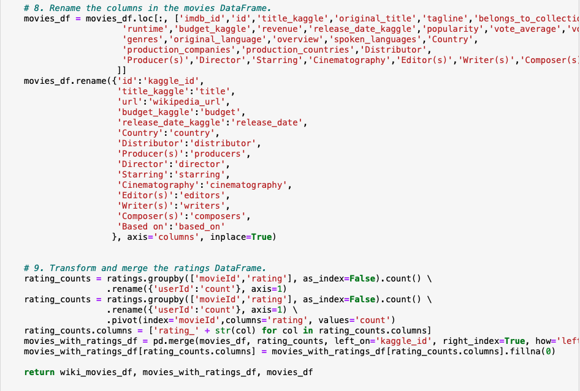

# Movies-ETL

## Overview
Amazing Prime Video was a platform for streaming movies and TV shows on Amazing Prime, the World's largest online retailer. The Amazing Prime video team would like to develop an algorithm to predict which low budget movies being releaed will become popular so that they can buy the streaming rights at a bargain. To inspire the team, have some fun, and connect with the local coding community, Amazing Prime has decided to sponsor a hackathon. Providing a clean data set of movie data and asking  participants to predict the popular pictures. 

In this project, we will create the datasets for the hackathon. There ar two data sources: a scrape of Wikipedia for all movies released since 1990, and rating data from the Movie Land's website. We will extract the data from the two sources, transform it into one clean data set, and finally load that data set into a SQL table. In general, it consists of four technical analysis deliverables:

Deliverable 1: Write an ETL Function to Read Three Data Files

Deliverable 2: Extract and Transform the Wikipedia Data

Deliverable 3: Extract and Transform the Kaggle data

Deliverable 4: Create the Movie Database

## Results
### Deliverable 1: Write an ETL Function to Read Three Data Files

### Deliverable 2: Extract and Transform the Wikipedia Data

### Deliverable 3: Extract and Transform the Kaggle data

### Deliverable 4: Create the Movie Database

